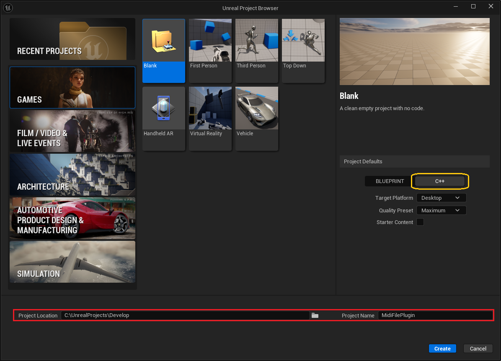
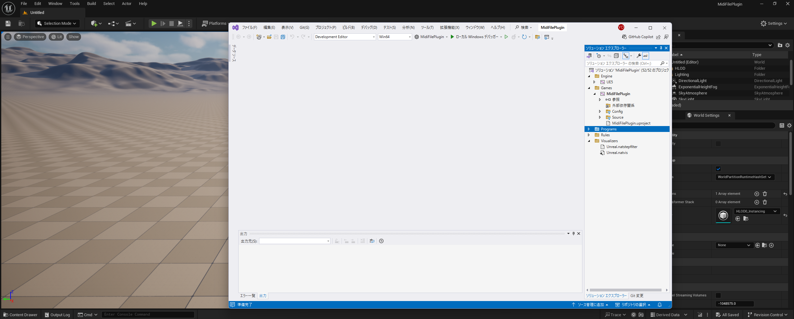

まず最初に、プラグイン開発を行うためのUnrealプロジェクトをUnreal Engineで作成します。
今回使用するUnreal Engineのバージョンは 5.5 です。

## プロジェクトを作成する際の注意点

Unreal Engineでプロジェクトを作成する際、プロジェクトの保存先を
ユーザーのドキュメントフォルダ内などにするとエラーが発生する場合があります。
この問題の主な原因は、Windowsのパス長制限(最大260文字)を超えるファイルが自動生成されてしまうことです。

参考 : [【UE4】文字数制限について - トンコツ開発ブログ](https://shuntaendo.hatenablog.com/entry/2019/08/07/230000)

### 解決策

この問題を回避するため、 `C:\` 直下にUnreal Engine用のフォルダを作成し、そこにプロジェクトを保存することをおすすめします。
例えば、私は `C:\UnrealProjects\Develop` を作成し、この中にプロジェクトを保存しています。

## プロジェクトを作成する手順

では、開発用プロジェクトを作成していきます。余計な機能が必要ないため、以下の設定を行いました。

* **Games** カテゴリから **Blank** を選択
* **Project Defaults** を `C++` に設定
* **Project Location** を適切に指定（例: `C:\UnrealProjects\Develop` ）

*プロジェクト作成時の注意*

C++ を選択してプロジェクトを作成すると、Unreal Engineが自動で初期設定を行い、しばらくコンパイルが実行されます。
コンパイルが成功すると、Visual Studio と Unreal Engineの両方が同時に開いた状態になります。

これで開発用プロジェクトの作成が完了です。

*プロジェクト作成が完了した画面*
